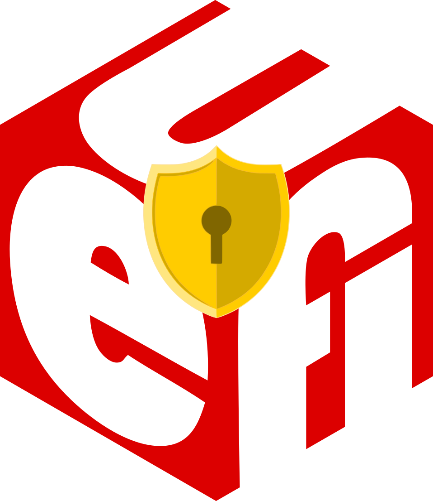

## Ubuntu UEFI Secure Boot with Mainline/Custom Kernels

The purpose of this repository is to explain how to sign Ubuntu kernels using a Machine Owner Key for use with UEFI Secure Boot.

It contains scripts to:

- Create and enroll Machine Owner Key (MOK) for signing kernels
- Post-installation scripts to automatically sign kernels with the MOK
     

## Introduction

UEFI Secure Boot (SB) is a verification mechanism for ensuring that code launched by a computer's UEFI firmware is trusted.  It is designed to protect a system against malicious code being loaded and executed early in the boot process, before the operating system has been loaded.  It is desirable to have this enabled to prevent user space programs from installing malicious booloaders, kernels or kernel modules.

Secure Boot does not work with Ubuntu kernels that were not provided in the Ubuntu APT repositories.  This is because Ubuntu only signs generic kernels that they release into the default repositories.  If booting a non-generic Ubuntu kernel, you will receive an error that the Linux image is not trusted or has an invalid signature.

It's common for advanced Linux users to experiment with newer kernel versions such as those available from:

- [Ubuntu Mainline](https://kernel.ubuntu.com/~kernel-ppa/mainline/?C=M;O=D)
- [Liqourix](https://liquorix.net/)

Hardware bug-fixes, hardware support or kernel features unlock functionality that is often desirable for advanced users.  Different CPU schedulers in non-generic kernels may result in better performance for certain workloads, such as gaming.  Therefore, it's beneficial to have the ability for users to sign kernels that they wish to install while keeping Secure Boot enabled.

### Shim

shim is a simple software package that is designed to work as a first-stage bootloader on UEFI systems.  Grub loads this as the primary EFI image on Secure Boot enabled Ubuntu installations.

A key part of the shim design is to allow users to control their own systems.  The distro CA key is built in to the shim binary itself, but there is also an extra database of keys that can be managed by the user, the so-called Machine Owner Key (MOK for short).

Keys can be added and removed in the MOK list by the user, entirely separate from the distro CA key.  The mokutil utility can be used to help manage the keys from Linux userland, but changes to the MOK keys may only be confirmed directly from the console at boot time.  This removes the risk of userland malware potentially enrolling new keys and therefore bypassing the entire point of SB.

### Requirements

- UEFI installation of Ubuntu/Linux
- MOK certificate capable of signing Linux kernel images
- The machine owner key enrolled into shim
- The kernel image is signed with the MOK certificate

### Usage

... To be expanded ...

### References

I used the following resources to compile this repository.

- https://wiki.ubuntu.com/UEFI/SecureBoot/Testing
- https://answers.launchpad.net/ubuntu/+question/697140
- https://gloveboxes.github.io/Ubuntu-for-Azure-Developers/docs/signing-kernel-for-secure-boot.html
- https://ubuntu.com/blog/how-to-sign-things-for-secure-boot
- https://gist.github.com/maxried/796d1f3101b3a03ca153fa09d3af8a11
- https://github.com/bkw777/mainline/issues/52